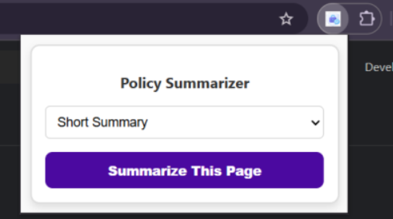

# 🔐 Policy Summarizer – Chrome Extension
A Chrome extension that helps users understand Privacy Policies & Terms & Conditions instead of blindly clicking “I Agree” every time.

## 📌 Problem Statement
In today’s digital world, most users ignore Privacy Policies and T&C because:

- They are too long
- Written in complex legal language
- Time-consuming to read
- Blindly agreeing can be dangerous:
- Your personal data may be collected, shared, or sold
- You may unknowingly give permissions you wouldn’t normally allow
- Hidden risks and red flags often go unnoticed

## 💡 Solution

Policy Summarizer solves this problem by:
Detecting policy / terms pages
Summarizing them using AI

Clearly explaining:

✅ What data is collected
📍 Where your data is used/shared
⚠️ Potential risks & red flags
👍 Safe or user-friendly practices
All this is shown directly on the same page, so users can make informed decisions before agreeing.

✨ Key Features

🔍 Detects Privacy Policy & T&C pages
🧠 AI-powered summarization using OpenAI
📋 Bullet-point summaries (easy to read)
🪟 Floating summary box (bottom-right)
🖱 One-click “Summarize This Page” popup
🎨 Clean, modern UI
🛠 Tech Stack

## 🔄 How It Works

User opens a Privacy Policy / Terms page
Extension extracts visible page text
Text is sent to OpenAI GPT model
AI generates a clear summary:
What data is collected
How it is used
Risks & red flags

A floating summary box appears on the page
User reads & decides whether to agree

📁 Folder Structure
``bash
PolicySummarizer_Extension/
│── manifest.json
│── background.js
│── content.js
│── popup.html
│── popup.js
│── popup.css
│── icons/
``

## 💻 Run Locally
```bash
git clone https://github.com/your-username/policy-summarizer-extension.git
```

Add your OpenAI API key in content.js

Open chrome://extensions/
Enable Developer Mode
Click Load Unpacked
Select the extension folder
Visit any Privacy Policy page
Click Summarize This Page

## 📸 Screenshots

### Extension in Chrome toolbar


### Popup UI



## 🧠 What I Learned

Chrome Extension architecture (Manifest V3)
Content scripts & background scripts
DOM text extraction
OpenAI API integration
Injecting UI elements into live webpages
Building user-centric privacy tools

## 🚀 Future Improvements

Multi-language support
Auto-summarization
Short / detailed summary modes
Export summary (PDF / Email)

Local caching for repeated pages

## 🤝 Open for Contribution

Contributions are welcome!
Ideas, bug fixes, UI improvements, and feature enhancements are appreciated 🚀
